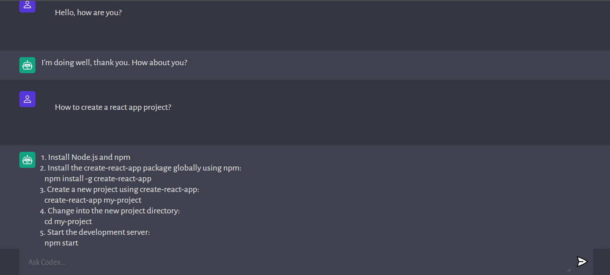

### OPEN_AI_CODEX

### Live demo: <a href="https://open-ai-codex-rho.vercel.app/">Click me</a> to Visit Finished project.

This is a simple openaicodex project built with Node.js and Express that uses [Natural language to OpenAI API](https://beta.openai.com/playground/p/default-openai-api?model=text-davinci-003) to generate Code Anwsers by inputing Natural language.



## Usage

Generate an API KEY at [OpenAI](https://beta.openai.com/) and add it to the `.env` file to the server folder.

Install the dependencies

```bash
npm install
```

Run server

```bash
npm run server
```

Visit `http://localhost:5000` in your browser.
